<picture>
  <source media="(prefers-color-scheme: dark)" srcset="assets/header-dark.svg">
  
</picture>

#### Blog: [https://loreley.one](https://loreley.one) 
#### Email: info@loreley.one

### Latest writing

<!-- BLOG-POST-LIST:START -->
- [WASM](https://loreley.one/2024-12-wasm/) · Dec 2024
- [Book review: Unraveling Principal Component Analysis](https://loreley.one/2024-09-pca/) · Sep 2024
- [ACDL 2024](https://loreley.one/2024-06-acdl/) · Jun 2024
- [Double Q-learning Explained](https://loreley.one/2024-03-double_q/) · Mar 2024
- [Will Gzip Replace Neural Networks for Text Classification?](https://loreley.one/2023-07-gzip/) · Jul 2023
<!-- BLOG-POST-LIST:END -->

